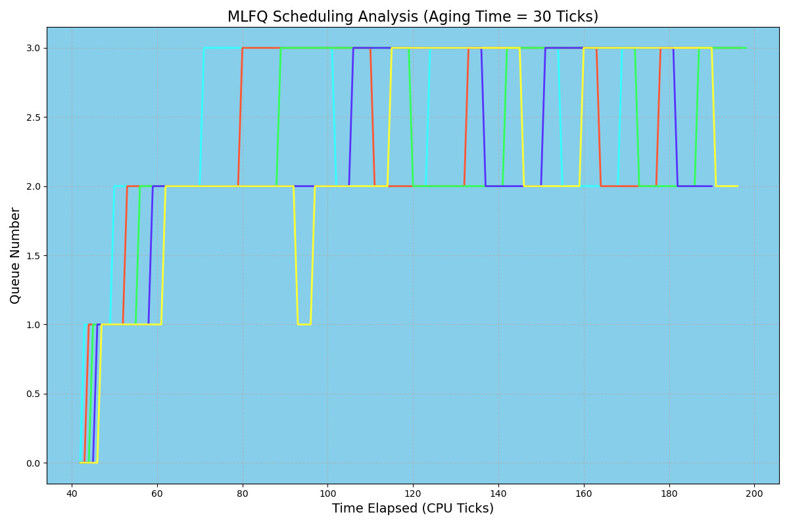

# Report for Scheduling
### Explanation and Implementation

## Round Robin (RR)

This was the default scheduling policy implemented in the XV-6 model. The processes keep alternating in a fixed order using `Context-Switch`. If the next process in the queue is in `RUNNABLE` state, then it is switched to `RUNNING` state.
In summary, It iterates through an array of processes, selects the next runnable process, performs a context switch to start executing the selected process, and then continues this process until all runnable processes have had a chance to run. The `acquire` and `release` operations are used to ensure proper synchronization and avoid race conditions when accessing shared resources.

## First Come First Serve (FCFS)

This scheduling policy prefers the process with the minimum arrival time and runs it first. Therefore the process that arrives first in the system is executed first irrespective of all other factors like duration, interrupts, etc.
To summarize, this code snippet is attempting to find the next `RUNNABLE` process with the minimum arrival time and switching the CPU context to execute that process. It ensures that only one process is executing at a time by using `locks` to synchronize access to the process data.

## Multi Level Feedback Queues (MLFQ)

`MLFQ` implements and maintains a multi-level priority system. All processes are first sent to queue 0 (highest priority). After a process runs for a certain `limit time`, it is demoted to the lower priority queue if it is still not finished/interrupted.
The `limit times` for the priority queues are as follows:
- Queue 0 : `1 tick`
- Queue 1 : `3 ticks`
- Queue 2 : `9 ticks`
- Queue 3 : `15 ticks`
Also if a process has been waiting for more than `30 ticks`, then it is boosted up to the immediate higher priority queue. This is called `Aging Policy`. If a `User Interrupt` or `Kernel Interrupt` occurs, then the processes are again promoted and demoted according to the above defined criterias.
**NOTE:** Promoting/demoting does not happen while a process is running on the CPU.
The code implements a multi-level priority queue scheduler where processes are moved between different priority queues based on their execution behavior. Processes accumulate ticks and are moved to higher or lower priority queues according to certain conditions. The code ensures that processes are executed based on their priority levels, allowing for dynamic adjustment of process priorities based on their behavior and waiting times. This scheduler aims to balance responsiveness and fairness in process execution within the system.

## Time Comparisons

| Scheduling Policy | Average Run Time (rtime) | Average Wait Time (wtime) |
| --- | --- | --- |
| RR | 14 | 155 |
| FCFS | 13 | 128 |
| MLFQ | 14 | 147 |

All these values are obtained while running on 1 CPU.

## MLFQ Scheduling Analysis

The graph obtained between `Queue Number` and `Number of Ticks` is given below:

